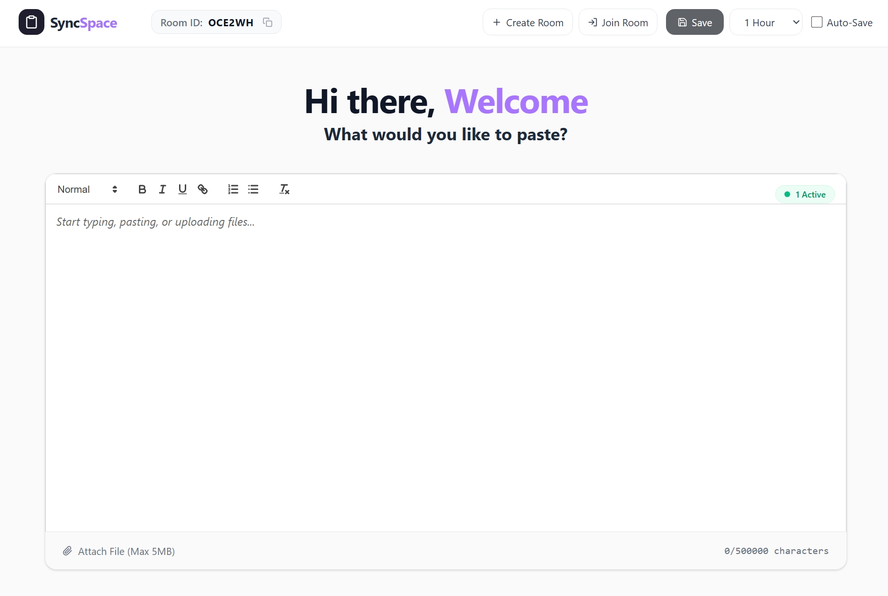

# SyncSpace


An anonymous, real-time clipboard workspace. Drop text, links, files, or code snippets and see them sync instantly across all your devices without ever needing to log in or create an account. 

## Live Demo
**Check out the live application here:** [https://syncspace1.vercel.app/]

---

## Features

* **Real-Time Syncing:** Powered by Supabase WebSockets. Watch text update instantly across multiple browser windows and devices.
* **Rich Text Editing:** Format your notes, create lists, and drop instantly clickable hyperlinks using the built-in React Quill editor.
* **File Attachments:** Upload images or documents (up to 5MB) directly into your workspace. Secure download links are automatically generated and synced.
* **Smart Auto-Save:** Built-in debouncing ensures your data is saved securely without overwhelming the database with API calls.
* **Frictionless Rooms:** Generate a random 6-digit room code instantly, or join an existing room via a sleek, user-friendly modal.
* **Modern UI:** A clean, responsive, light-mode interface styled flawlessly with Tailwind CSS.




## Tech Stack

* **Frontend:** React (built with Vite)
* **Routing:** React Router DOM
* **Editor:** React Quill (`react-quill-new`)
* **Styling:** Tailwind CSS
* **Backend / Database:** Supabase (PostgreSQL)
* **Realtime:** Supabase Realtime Channels
* **File Storage:** Supabase Storage Buckets
* **Deployment:** Vercel

## Getting Started (Run Locally)

Follow these instructions to set up the project locally on your machine.

### Prerequisites
Make sure you have [Node.js](https://nodejs.org/) installed on your machine. You will also need a free [Supabase](https://supabase.com/) account.

### 1. Clone the repository
```bash
git clone https://github.com/16niraj/syncspace.git
cd syncspace
```

### 2. Install dependencies
``` bash
npm install
```

### 3. Set up Supabase

1. Create a new Supabase project.
2. Go to the SQL Editor and run this query to create your table:
``` bash
CREATE TABLE rooms (
  id text PRIMARY KEY,
  content text,
  expires_at timestamp with time zone
);
```
3. Go to Storage and create a new bucket named room-files. Make sure to toggle Public bucket to ON.
4. Run this query in the SQL Editor to allow public uploads to your bucket:
``` bash
CREATE POLICY "Allow public uploads" 
ON storage.objects FOR INSERT 
TO public 
WITH CHECK (bucket_id = 'room-files');
```
5. Configure Environment Variables
Create a file named .env.local in the root directory of your project and add your Supabase project credentials:
``` bash
VITE_SUPABASE_URL=https://your-project-id.supabase.co
VITE_SUPABASE_ANON_KEY=your-super-long-anon-key
```
6. Run the development server
``` bash
npm run dev
```

Open http://localhost:5173 in your browser to view the app.

### License
This project is open-source and available under the MIT License.